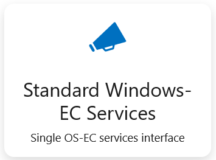
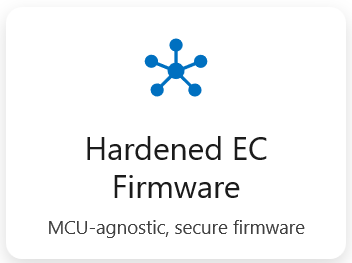
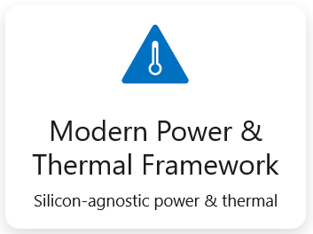
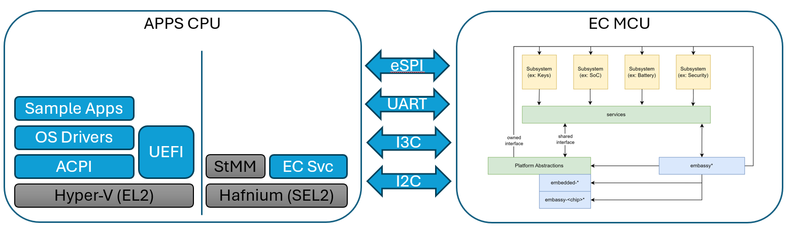

# Open Device Partnership Overview

## Overview
An alliance of industry-leading PC ecosystem partners promoting secure, reusable, and trusted system software for client devices

The Open Device Partnership (ODP) is an open-source initiative focused on:
- enhancing device security
- simplifying cross-architecture development (ARM & x86 standards)
- strengthening fundamentals (“raise all boats”)
- accelerating the delivery of high-quality devices

Designed from the onset to be inclusive of all device ecosystem partners and stakeholders
- one stop location for everything needed to build a Windows client device

Optimized for Windows devices but only successful if Linux can also thrive

Open-source (MIT) with open governance focused on driving ecosystem innovation

Long time-horizon investment (start by meeting partners where they are today)

## Projects

 

## Architectural Overview 

The following diagram shows the various aspects of client devices that ODP contributes samples to.

