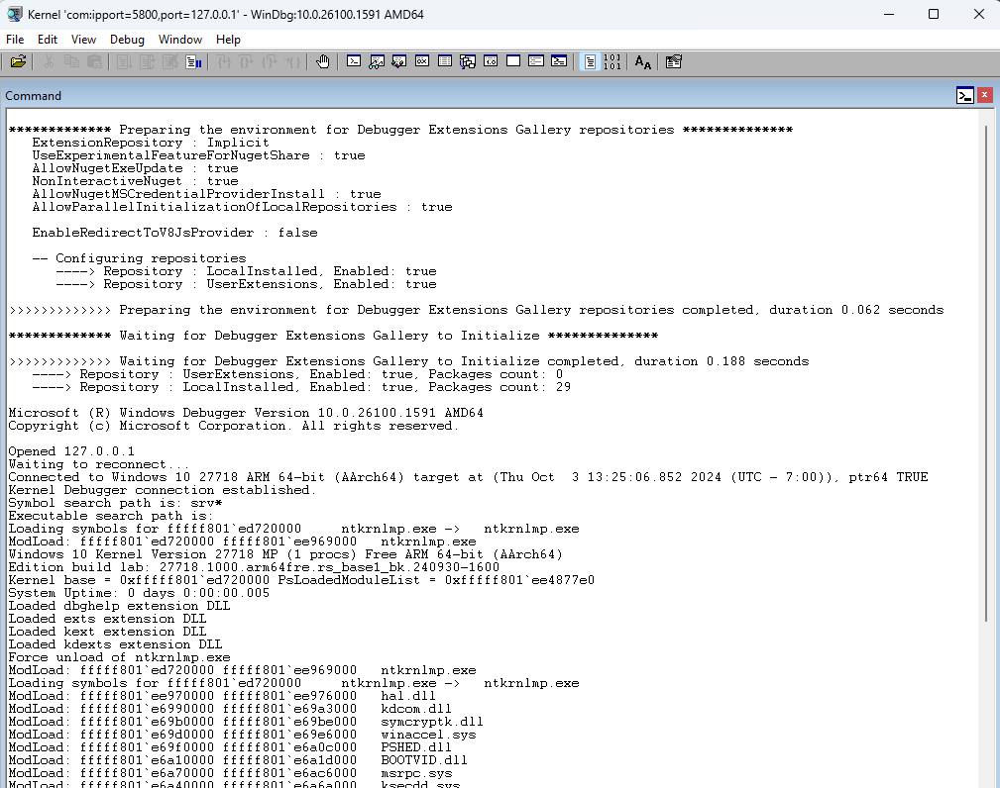

# Windbg Setup for QEMU

## Enabling Windbg
If Windows doesn't boot properly on QEMU you are basically stuck wondering what is happening with no output after bootmgr starts there will be no further update in the serial port. To debug windows drivers and boot you will need to enable debugger in your image and redirect your serial port output.

To enable KDCOM in your windows image you can mount your WinVOS.vhdx file but just double clicking on it in windows and it will mount the windows drive. It will not allow you to mount the EFIESP partition which has your BCD configuration so you will manually need to do this from administrator command prompt
```
mountvol list
   \\?\Volume{6db5162d-2579-4177-a1a5-93ef900a229e}\
        E:\

    \\?\Volume{836aef00-39f3-4032-9859-edd5830c5bbf}\
        *** NO MOUNT POINTS ***

    \\?\Volume{c587fa46-aec7-40b5-ae44-610e51124aa2}\
        *** NO MOUNT POINTS ***
```

Normally the EFIESP volume is the last one listed here, but if it fails to mount the one try the other one. It will be one of the volumes without a mount point. Make sure the location you try to mount it the folder must exist already.

```
mountvol d:\temp\mount \\?\Volume{c587fa46-aec7-40b5-ae44-610e51124aa2}\
cd d:\temp\mount\EFI\Microsoft\Boot
bcdedit /store BCD /enum all
bcdedit /store BCD /set {default} debug on
bcdedit /store BCD /dbgsettings serial debugport:1 baudrate:115200
mountvol d:\temp\mount /d
```

Don't forget to eject or dismount the VHDX after you've unmounted the EFIESP partition.
If you want to debug early boot process because it is not making it into NTOS you can enable bootdebug as well

`bcdedit /store BCD /set {globalsettings} bootdebug yes`

After modifying your vhdx be sure to convert to qcow2 format again using qemu-img and copy to the location that qemu is loading the image from.

You will also need to change your serial output port as part of qemu command line, otherwise windbg can't connect with KDCOM through stdio. Update the -seral to use a localhost port which will get exposed outside of WSL
`-serial tcp:127.0.0.1:5800,server,nowait`

<b>Note:</b> Each time you restart the qemu the port will go away and you need to restart windbg after qemu has started otherwise it will not open the port properly after. To connect to your port with windbg you will need to run from the command line using the following:

`windbg -k com:ipport=5800,port=127.0.0.1 -v`

Now when Windows starts you will see it connect with Windbg and you can debug as you normally would.



## Debugging QEMU with GDB
When debugging in UEFI, secure world, or when system isn't responding you will often find yourself needing a GDB connection to the device.
QEMU has built in support for GDB interface and makes it very easy to debug with GDB.

From the qemu command line just add the following option
`-gdb tcp::1234`

Now after your system starts or is in the state you want to connect you can use
```
gdb-multiarch
(gdb) set debug aarch64
(gdb) target extended-remote localhost:1234

```
For more details debugging with GDB or using Windbg with GDB you can read the following documents.
[GDB Debugger](https://github.com/microsoft/mu_tiano_platforms/blob/main/Platforms/Docs/Common/debugging.md)