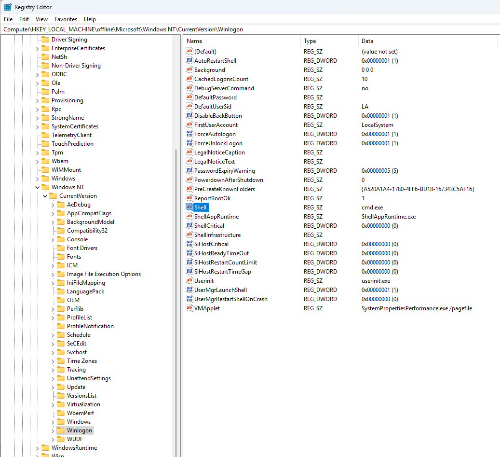

# Modifying Windows Image

## Injecting Drivers into Vhdx Windows Image

Injecting drivers and registry entries into your VHDX image is straight forward using DISM. You will need the driver binaries and inf file to install the driver.

1. Mount the VHDX by double clicking on it and noting the drive letter that is mounted
2. Inject your driver using DISM

    `dism /Image:e:\ /Add-Driver /Driver:d:\drivers\testdrv`

3. This will execute the installation steps in the INF including copying your driver into the mounted image and updating the registry. Make sure the operation completes successfully. If you have multiple drivers you can use the /Recurse option to install all inf files.
4. Make sure to cleanly unmount your VHDX drive.
5. Convert your VHDX to qcow2 image using qemu-img and run your new windows image with QEMU.
    
    `qemu-img convert -p -O qcow2 ValidationOS.vhdx winvos.qcow2`

## Injecting Executables and Autorun

To inject executable content you can simply click on the VHDX file to mount it and make a folder and copy content to the device. If you are trying to overwrite existing system content you may need to make yourself the owener and allow overwrite permissions. Sfpcopy can also be used to accomplish secure copy.

```
takeown /f <filename>
icacls <filename> /grant everyone:f
copy <localfile> <destfile>
```

To automatically run an executable in WinVOS you can edit the registry in the VHDX.

1. Mount the VHDX image by double clicking on it and noting the drive letter.
2. Run regedit as administrator.
3. Select the root of HKLM.
4. File -> Load Hive and browse to your mounted drive under e:\windows\system32\config\SOFTWARE
5. Name the mount location "Offline"
6. Browse to the following key `Computer\HKEY_LOCAL_MACHINE\offline\Microsoft\Windows NT\CurrentVersion\Winlogon`
7. Modify the "Shell" REG_SZ entry which just runs `cmd.exe` by default.
8. After you've modified the key be sure to select the root of the offline folder and select File -> Unload Hive
9. Unmount your VDHX file to make sure it is saved
10. Convert windows image to qcow2 and load in QEMU




[Return to Library](../../library.html)