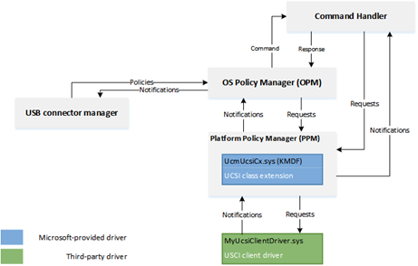

# UCSI Interface

EC must have the ability to interface with a discrete PD controller to
negotiate power contracts/alt-modes with port partner

See the UCSI specification for commands that are required in all UCSI
implementations.

[USB-C Connector System Software Interface (UCSI) Driver - Windows
drivers | Microsoft
Learn](https://learn.microsoft.com/en-us/windows-hardware/drivers/usbcon/ucsi)

In addition to the commands marked as **Required**, Windows requires
these commands:

  - GET_ALTERNATE_MODES

  - GET_CAM_SUPPORTED

  - GET_PDOS

  - SET_NOTIFICATION_ENABLE: The system or controller must support the
    following notifications within SET_NOTIFICATION_ENABLE:
    
      - Supported Provider Capabilities Change
    
      - Negotiated Power Level Change

  - GET_CONNECTOR_STATUS: The system or controller must support these
    connector status changes within GET_CONNECTOR_STATUS:
    
      - Supported Provider Capabilities Change
    
      - Negotiated Power Level Change



## UCSI ACPI Interface


### Shared Mailbox Interface

The following table is the reserved memory structure that must be
reserved and shared with the EC for communication. When using FF-A this
memory region must be statically carved out and 4K aligned and directly
accessible by secure world.

| **Offset (Bytes)** | **Mnemonic** | **Description**                                           | **Direction** | **Size (bits)** |
| ------------------ | ------------ | --------------------------------------------------------- | ------------- | --------------- |
| 0                  | VERSION      | UCSI Version Number                                       | PPM->OPM       | 16              |
| 2                  | RESERVED     | Reserved                                                  | N/A            | 16              |
| 4                  | CCI          | USB Type-C Command Status and Connector Change Indication | PPM->OPM       | 32              |
| 8                  | CONTROL      | USB Type-C Control                                        | OPM->PPM       | 64              |
| 16                 | MESSAGE IN   | USB Type-C Message In                                     | PPM->OPM       | 128             |
| 32                 | MESSAGE OUT  | USB Type-C Message Out                                    | OPM->PPM       | 128             |

### ACPI Definitions
```
Device(USBC) {
  Name(_HID,EISAID(“USBC000”))
  Name(_CID,EISAID(“PNP0CA0”))
  Name(_UID,1)
  Name(_DDN, “USB Type-C”)
  Name(_ADR,0x0)

  OperationRegion(USBC, SystemMemory, 0xFFFF0000, 0x30)
  Field(USBC,AnyAcc,Lock,Preserve)
  {
    // USB C Mailbox Interface
    VERS,16, // PPM-\>OPM Version
    RES, 16, // Reservied
    CCI, 32, // PPM-\>OPM CCI Indicator
    CTRL,64, // OPM-\>PPM Control Messages
    MSGI,128, // OPM-\>PPM Message In
    MSGO,128, // PPM-\>OPM Message Out
  }

  Method(_DSM,4,Serialized,0,UnknownObj, {BuffObj, IntObj,IntObj,PkgObj})
  {
    // Compare passed in UUID to Supported UUID
    If(LEqual(Arg0,ToUUID(“6f8398c2-7ca4-11e4-ad36-631042b5008f”)))
    {
      // Use FFA to send Notification event down to copy data to EC
      If(LEqual(\\_SB.FFA0.AVAL,One)) {
        Name(BUFF, Buffer(144){}) // Create buffer for send/recv data
        CreateByteField(BUFF,0,STAT) // Out – Status for req/rsp
        CreateByteField(BUFF,1,LENG) // In/Out – Bytes in req, updates bytes returned
        CreateField(BUFF,16,128,UUID) // UUID of service
        CreateByteField(BUFF,18, CMDD) // In – First byte of command
        CreateField(BUFF,144,1024,FIFD) // Out – Msg data

        CreateField(BUFF,0x0,128,UUID)
        // Create USCI Doorbell Event

        Store(20, LENG)
        Store(0x0, CMDD) // UCSI set doorbell
        Store(ToUUID("daffd814-6eba-4d8c-8a91-bc9bbf4aa301"), UUID) // UCSI
        Store(Store(BUFF, \_SB_.FFA0.FFAC), BUFF)

        If(LEqual(STAT,0x0) ) // Check FF-A successful?
        {
          Return (FIFD)
        } else {
          Return(error)?
        }
      } // End AVAL
    } // End UUID
  } // End DSM
}

```

