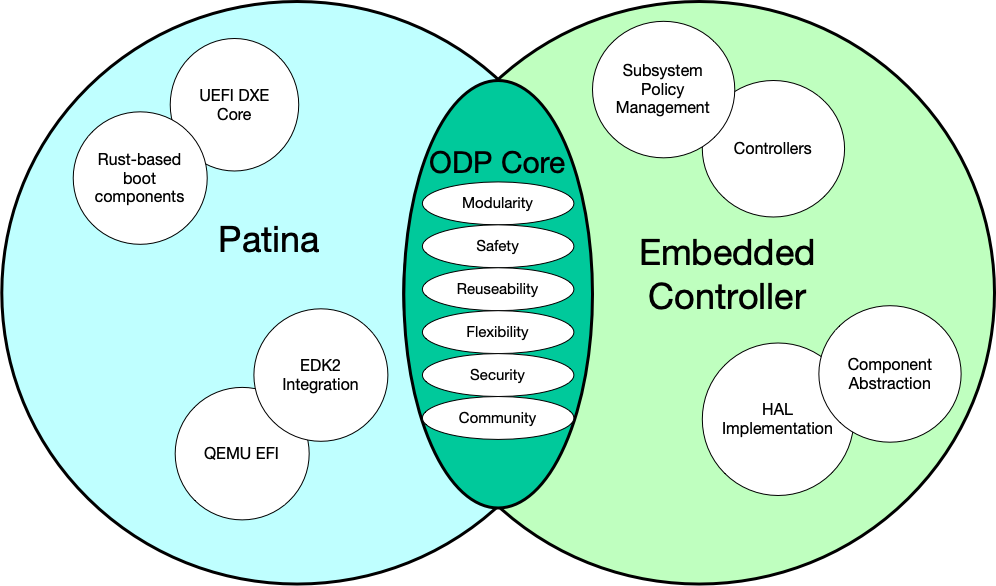

# ODP Architecture
The __Open Device Partnership (ODP)__ architecture is designed to provide a modular, scalable, and secure framework for developing embedded systems. Rooted in Rust's safety guarantees and shaped by a philosophy of composable components, ODP offers a consistent foundation for both low-level and system-level firmware development.

ODP spans two distinct domains: The __Patina framework__, a Rust-based system for building DXE-style boot firmware, and the __Embedded Controller (EC)__, architecture, supporting microcontroller-based runtime services and coordination.

Though their implementations differ, these domains are united under the ODP model by shared principles and architectural patterns. Together, they promote a unified approach to firmware engineering that emphasizes safety, reuse, and composability.

> #### Figure: ODP Architecture Across Domains
> The ODP Core expresses a set of shared design patterns -- such as modularity, safety, and flexibility -- that are applied independently within two distinct ecosystems: Patina (x86 firmware) and Embedded Controller (μC runtime). Each domain develops its own components, tooling, and conventions while adhering to the same architectural principles. 

## Common Patterns of ODP
While Patina and EC serve different ends of the firmware spectrum, they share a common set of patterns and priorities that define the ODP approach:
- **Modularity**: ODP components are explicitly modular. Each unit is independently defined and can be composed into larger systems through clearly defined interfaces. This is central to the dependency-injection models used by both Patina and EC's service registry architecture.
- **Safety**: Rust’s type system and ownership model are used to enforce memory and concurrency safety at compile time. This baseline ensures that ODP firmware avoids common pitfalls typical of C-based implementations.
- **Reusability**: Components are designed to be reusable across platforms, configurations, and targets. Traits and message interfaces abstract functionality, enabling code reuse without sacrificing clarity or safety.
- **Flexibility**: The ODP structure supports adaptation to a wide variety of host platforms and runtime environments. This flexibility allows implementers to scale from minimal EC services up to full boot firmware stacks.
- **Community**: ODP is built on open standards and community contributions. This encourages collaboration, knowledge sharing, and the evolution of best practices across the ecosystem, which only enhances the robustness of the architecture and its promises of safety and modularity.

The Open Device Partnership is founded more upon _alignment_ than _unification_ and is supported and extended by the principles of a strong Open Source community, where it will expand and evolve.