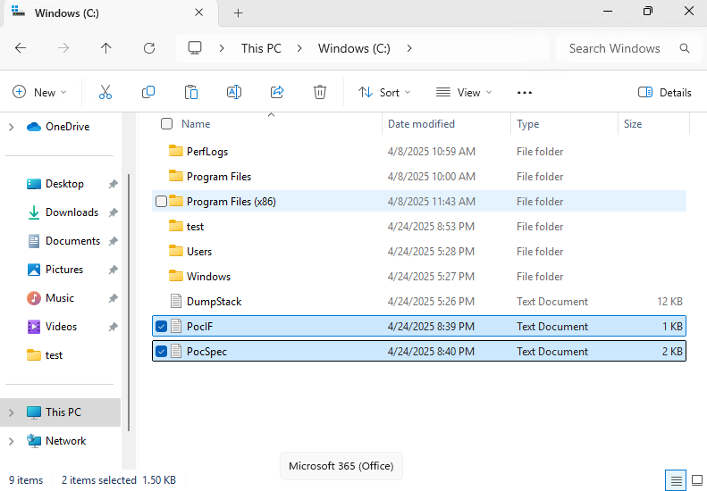
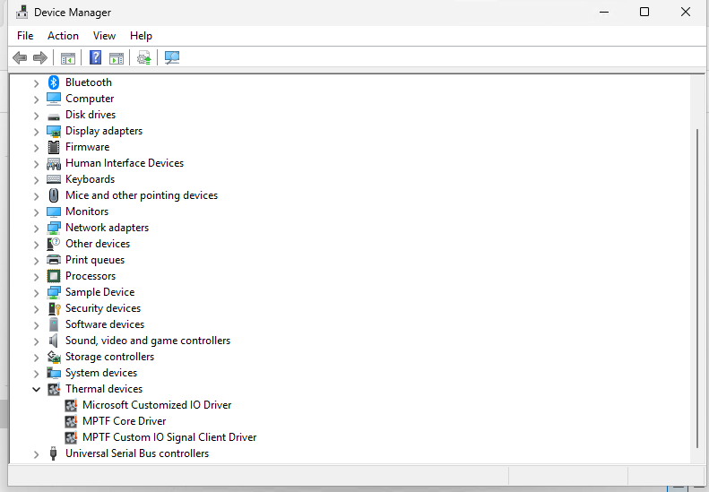
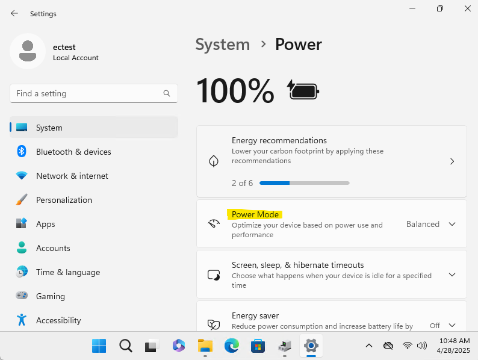

# MPTF Demo

## Prerequisites

You will need a hardware platform that has the following:
- Boots OS 26400 or later with MPTF support
- ACPI changes for Custom IO and MPTF driver loading
- haf-ec-service with eSPI or other transport from ODP
- MCU firmware code that runs on your MCU from ODP

## MPTF and Customized IO

After booting the device copy both the following PocIF.txt and PocSpec.txt to root folder on the device

- [PocIF.txt](media/PocIF.txt)
- [PocSpec.txt](media/PocSpec.txt)



After copying these files we reboot the computer and check in device manager to make sure MPTF devices are all running with no failures.



Open System Settings and select Power



With windbg connecteded and logging enabled for Microsoft Custom IO driver when we change the power mode we will see values being selected.

```
!wmitrace.stop MptfIo -kd
!wmitrace.start MptfIo -kd
!wmitrace.enable MptfIo {D0ABE2A4-A604-4BEE-8987-55C529C06185} -level 0x7 -flag 0xFFFF
!wmitrace.dynamicprint 1
.reload /f
```

As you select the different values for Balanced, Best Performance etc you will see it executing the Customized IO functions with the corresponding values defined form the PocSpec.

```
[1]0004.03A4::04/28/2025-10:58:28.051 [kernel] [SmfInterface_RequestCompletionHandling]Deferred execution: Data write activated
[1]0004.03A4::04/28/2025-10:58:28.067 [mptfcustomizeiosignalclient] [MptfInterfaceDataSet]MptfInterfaceDataSet Received data on channel:0 with value:35 FunctionId 2.
[3]0004.03A4::04/28/2025-10:58:30.211 [kernel] [SmfInterface_RequestCompletionHandling]Deferred execution: Data write activated
[3]0004.03A4::04/28/2025-10:58:30.243 [mptfcustomizeiosignalclient] [MptfInterfaceDataSet]MptfInterfaceDataSet Received data on channel:0 with value:25 FunctionId 2.
[1]0004.03A4::04/28/2025-10:58:32.387 [kernel] [SmfInterface_RequestCompletionHandling]Deferred execution: Data write activated
[1]0004.03A4::04/28/2025-10:58:32.403 [mptfcustomizeiosignalclient] [MptfInterfaceDataSet]MptfInterfaceDataSet Received data on channel:0 with value:15 FunctionId 2.
```

## Hafnium EC Service

Now we demonstrate that the data is received and requests are processed in secure world side. Connecting terminal to our debug serial port we can get the Hanfnium debug messages for each of these power modes we select.

We see that it calls set_variable for instance id: 0x1 with the variable UUID we specify in our ACPI the the value select from the UI

```
11:02:10.823 : SP 8003: DEBUG - Successfully received ffa msg:
11:02:10.824 : SP 8003:             function_id = c400008d
11:02:10.824 : SP 8003:                    uuid = 31f56da7-593c-4d72-a4b3-8fc7171ac073
11:02:10.824 : SP 8003: DEBUG - Received ThmMgmt command 0x6
11:02:10.824 : SP 8003: DEBUG - set_variable instance id: 0x1
11:02:10.824 : SP 8003:                 length: 0x4
11:02:10.824 : SP 8003:                 uuid: 5cf839df-8be7-42b9-9ac5-3403ca2c8a6a
11:02:10.824 : SP 8003:                 data: 0x23
11:02:12.647 : SP 8003: DEBUG - Successfully received ffa msg:
11:02:12.647 : SP 8003:             function_id = c400008d
11:02:12.648 : SP 8003:                    uuid = 31f56da7-593c-4d72-a4b3-8fc7171ac073
11:02:12.648 : SP 8003: DEBUG - Received ThmMgmt command 0x6
11:02:12.648 : SP 8003: DEBUG - set_variable instance id: 0x1
11:02:12.648 : SP 8003:                 length: 0x4
11:02:12.648 : SP 8003:                 uuid: 5cf839df-8be7-42b9-9ac5-3403ca2c8a6a
11:02:12.648 : SP 8003:                 data: 0x19
11:02:14.199 : SP 8003: DEBUG - Successfully received ffa msg:
11:02:14.199 : SP 8003:             function_id = c400008d
11:02:14.200 : SP 8003:                    uuid = 31f56da7-593c-4d72-a4b3-8fc7171ac073
11:02:14.200 : SP 8003: DEBUG - Received ThmMgmt command 0x6
11:02:14.200 : SP 8003: DEBUG - set_variable instance id: 0x1
11:02:14.200 : SP 8003:                 length: 0x4
11:02:14.200 : SP 8003:                 uuid: 5cf839df-8be7-42b9-9ac5-3403ca2c8a6a
11:02:14.200 : SP 8003:                 data: 0xf
```

## EC MCU Functionality

Finally we validate that the uCode running on the MCU actually receives this data and takes the correct corresponding action. In this example we directly map this variable to the fan RPM as a percentage. As you change the setting in the UI and see the commands in Hafnium EC Service changing values in peripheral channel on the MCU side we receive those notfications and set the fan speed accordingly

Add debug output from MCU here as well.